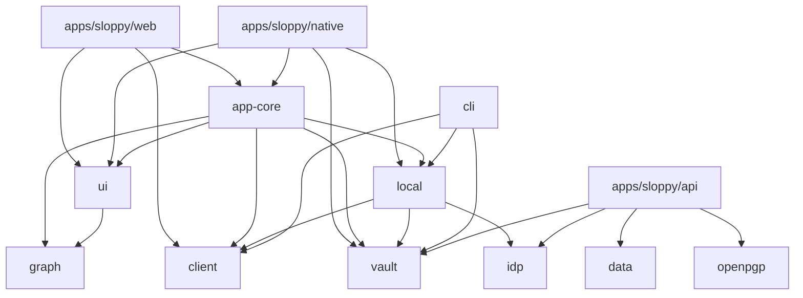

<!-- block 01M3HKX290A7GMBN1JS1CW7N8X -->

[package.json](code:package.json)

<!-- block 01M3HKX2928Y54ERN045YNFB63 -->

## What this is

Sloppy is a knowledge graph with two axes: a note's genealogy (what it sprang out of, cited by a Folgezettel address like `1a1`) and its tags (sets that cut across that tree). The genealogy is the protocol a peer holds a copy of; everything else is replaceable. The rules are stated once in [AI.md](code:AI.md), the shape they apply to in [docs/ARCHITECTURE.md](code:docs/ARCHITECTURE.md), and the look and product direction in [DESIGN.md](code:DESIGN.md) and [PRODUCT.md](code:PRODUCT.md).

It is a pnpm + Turborepo monorepo: three deployables under `apps/sloppy/` and eleven shared TypeScript packages under `packages/ts/`, with Rust only inside the native shell's `src-tauri/`. The layout is drawn in [the monorepo layout](code:docs/ARCHITECTURE.md#L28-L81).

<!-- block 01M3HKX299F9KDXTMWB65H327A -->

## Three ways it runs

One client serves all three, and none of them is special-cased in a page ([deployment modes](code:docs/ARCHITECTURE.md#L10-L26))\:

- **Hosted** — the API plus a syr instance run for you.
- **Self-hosted** — somebody else's API and syr instance, pointed at from settings.
- **Local-only** — no server at all: the native app opens a folder, and the vault of markdown files in it is the whole store.

Identity, profiles, media and reactions belong to **syr**; graphs, notes, addresses, tags and blocks belong to Sloppy's own API and SurrealDB. That split is enforced by syr, not chosen here.

<!-- block 01M3HKX29CQ0PSHM3CQ1FPX958 -->

## How the parts lean on each other

Every package leans on `@sloppy/types`; the lines to it are left off to keep the picture readable. The client side (app-core and below) never imports the API; it reaches it through `@sloppy/client` over the wire, or through `@sloppy/local` on the device.

<!-- block 01M3HKX29ESR24XR3036P7KVK5 -->

## The seam every surface goes through

Two files in app-core decide where a page's data comes from and what the platform can do: `runtime.ts` (an `AppRuntime` whose absent members mean something) and `api.ts` (a proxy that resolves to the remote client or the on-device one without a call site changing). See [the platform seam](code:docs/ARCHITECTURE.md#L83-L115). On native, `@sloppy/local` fills both.

<!-- block 01M3HKX29HSQ2K7W4RK9S51TZ2 -->

## Where to go next

The notes under this one take the repository a part at a time: the three apps, then the shared packages. Each says what the part is for and where its doc of record is; the per-function detail hangs beneath those.

Checks run from the root with `pnpm check`, `pnpm lint` and `pnpm test`, plus `cargo fmt` and `cargo clippy` for the native shell ([verification](code:docs/ARCHITECTURE.md#L3819)).
